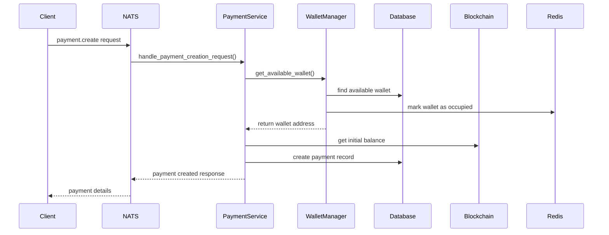
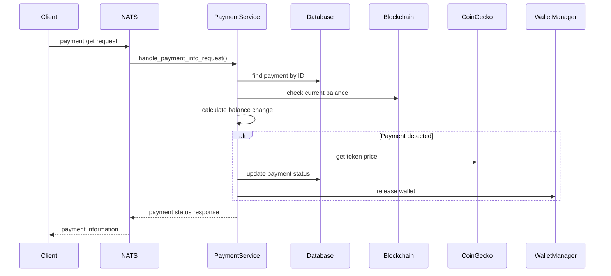
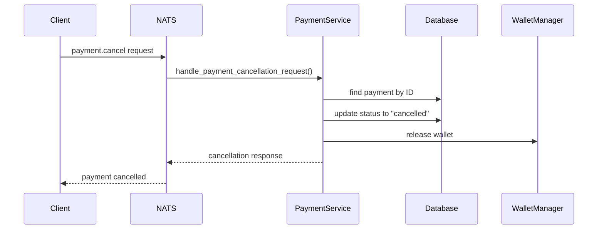

# OnChain Payments Service

## Описание проекта

**OnChain Payments** — это микросервис для обработки криптовалютных платежей в различных блокчейн-сетях. Сервис предоставляет API для создания, отслеживания и отмены платежей через NATS messaging system.

## Поддерживаемые сети и токены

### Блокчейн-сети:
- **Ethereum** - основная сеть Ethereum
- **Polygon** - Layer 2 решение для Ethereum
- **Arbitrum** - Layer 2 решение для Ethereum
- **Optimism** - Layer 2 решение для Ethereum
- **Solana** - независимая блокчейн-сеть

### Поддерживаемые токены:
- **ETH** - нативная валюта Ethereum
- **USDT** - Tether (стабильная монета)
- **USDC** - USD Coin (стабильная монета)
- **SOL** - нативная валюта Solana

## Архитектура системы

### Основные компоненты:

1. **NATS Message Handlers** (`handlers.py`)
   - Обработка входящих сообщений через NATS
   - Три основных эндпоинта для работы с платежами

2. **Payment Logic** (`logic/payments.py`)
   - Основная бизнес-логика обработки платежей
   - Интеграция с блокчейн-сетями через Web3
   - Управление балансами и отслеживание изменений

3. **Wallet Manager** (`logic/wallet_manager.py`)
   - Управление пулом кошельков
   - Распределение адресов для платежей
   - Освобождение кошельков после завершения транзакций

4. **Database Layer** (`logic/database.py`)
   - Подключение к MongoDB
   - Хранение данных о платежах

5. **Utils** (`logic/utils.py`)
   - Получение актуальных цен токенов через CoinGecko API
   - Вспомогательные функции

## Алгоритм работы

### 1. Создание платежа (`payment.create`)



**Процесс:**
1. Получение запроса на создание платежа
2. Выбор доступного кошелька из пула
3. Получение начального баланса кошелька
4. Создание записи о платеже в базе данных
5. Возврат данных о созданном платеже

### 2. Обработка платежа (`payment.get`)



**Процесс:**
1. Поиск платежа в базе данных
2. Проверка текущего баланса кошелька
3. Вычисление изменения баланса
4. При обнаружении платежа:
   - Получение актуальной цены токена
   - Обновление статуса платежа на "paid"
   - Освобождение кошелька для повторного использования

### 3. Отмена платежа (`payment.cancel`)



## API Endpoints

### NATS Subjects:

1. **`onchain_payments.payment.create`**
   - Создание нового платежа
   - **Параметры:** `payment_network`, `payment_token`
   - **Ответ:** данные созданного платежа

2. **`onchain_payments.payment.get`**
   - Получение информации о платеже
   - **Параметры:** `payment_id`
   - **Ответ:** текущий статус и данные платежа

3. **`onchain_payments.payment.cancel`**
   - Отмена платежа
   - **Параметры:** `payment_id`
   - **Ответ:** обновленный статус платежа

## Структура данных

### Payment Model:
```python
{
    "payment_id": "uuid",
    "payment_network": "ethereum|polygon|arbitrum|optimism|solana",
    "payment_token": "eth|usdt|usdc|sol",
    "payment_address": "blockchain_address",
    "status": "pending|paid|cancelled",
    "payment_amount": float,  # количество полученных токенов
    "outcome_amount": float,  # эквивалент в USD
    "created_at": datetime,
    "initial_balance": float  # начальный баланс кошелька
}
```

## Технические особенности

### 1. Управление кошельками
- **Пул кошельков:** система поддерживает пул предварительно созданных кошельков
- **Блокировка:** Redis используется для блокировки кошельков во время использования
- **Освобождение:** кошельки автоматически освобождаются после завершения или отмены платежа

### 2. Отслеживание платежей
- **Начальный баланс:** фиксируется при создании платежа
- **Мониторинг изменений:** система отслеживает изменения баланса
- **Автоматическое определение:** платеж считается выполненным при увеличении баланса

### 3. Поддержка множественных сетей
- **EVM-совместимые сети:** Ethereum, Polygon, Arbitrum, Optimism
- **Solana:** отдельная реализация для SPL токенов
- **Унифицированный API:** единый интерфейс для всех сетей

### 4. Обработка ошибок
- **Валидация данных:** проверка корректности входящих параметров
- **Graceful degradation:** корректная обработка ошибок сети
- **Логирование:** подробное логирование всех операций

## Зависимости

### Основные библиотеки:
- **NATS** - messaging system
- **Web3.py** - взаимодействие с EVM-сетями
- **Motor** - асинхронный MongoDB драйвер
- **Redis** - управление состоянием кошельков
- **Pydantic** - валидация данных
- **aiohttp** - HTTP клиент для внешних API

### Внешние сервисы:
- **MongoDB** - хранение данных о платежах
- **Redis** - управление блокировками кошельков
- **CoinGecko API** - получение актуальных цен токенов
- **Blockchain RPC nodes** - подключение к блокчейн-сетям

## Развертывание

### Docker
Сервис упакован в Docker контейнер с использованием Poetry для управления зависимостями:

```bash
docker build -t onchain-payments .
docker run -d onchain-payments
```

### Конфигурация
Сервис использует централизованную конфигурацию через `src.core.config.settings` для:
- Подключения к NATS
- Настроек MongoDB
- Настроек Redis
- URL блокчейн-нод
- Параметров CoinGecko API

## Безопасность

### Рекомендации:
1. **Приватные ключи:** кошельки должны быть созданы заранее и храниться в безопасном месте
2. **RPC endpoints:** использовать приватные ноды для продакшена
3. **Мониторинг:** отслеживание подозрительной активности
4. **Rate limiting:** ограничение частоты запросов к внешним API

## Мониторинг и логирование

Сервис включает подробное логирование:
- Создание и обработка платежей
- Ошибки сети и валидации
- Состояние кошельков
- Производительность запросов

Рекомендуется настроить мониторинг для:
- Количества активных платежей
- Доступности кошельков
- Времени отклика блокчейн-нод
- Ошибок обработки платежей
